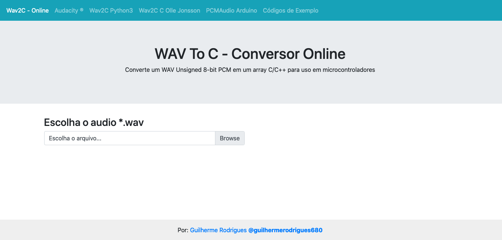
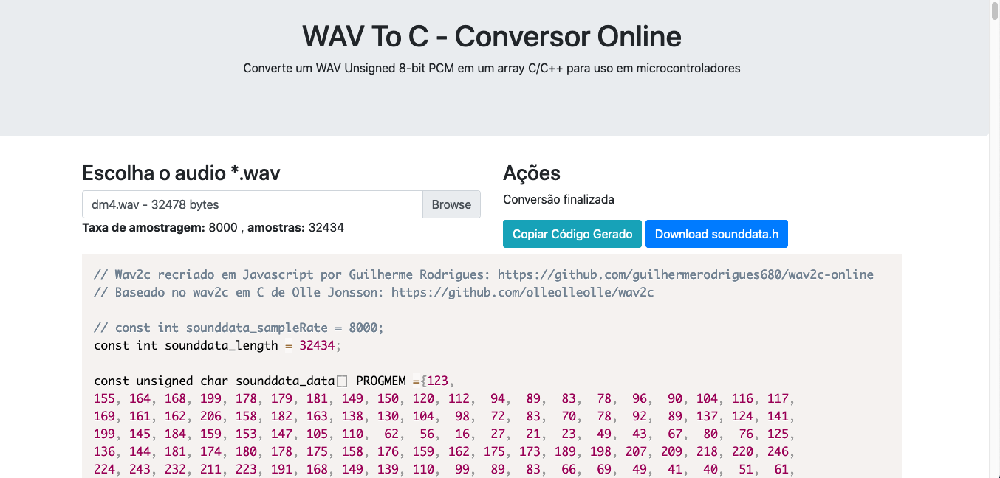

<h1 align="center">
   
  
  
  
   
  wav2c online
   
</h1>

<h2 align="center">Conversor escrito em Javascript que lê um WAV Unsigned 8-bit PCM e converte em um array C/C++ para uso em microcontroladores</h2>

    
    
    
    
    

### Tabela de Conteúdo ###
1. [wav2c-online](#wav2c-online)
2. [Descrição](#descrição)
3. [Exemplo de uso](#Exemplo-de-uso)
4. [Capturas de tela](#Capturas-de-tela)
5. [Links](#Links)
6. [Contributor](#Contributor)
7. [License](#License)

# wav2c-online
Acesse o conversor em: [guilhermerodrigues680.github.io/wav2c-online](https://guilhermerodrigues680.github.io/wav2c-online)  
Video onde explico Como converter e reproduzir áudio usando o Arduino sem módulo mp3:  
https://www.youtube.com/watch?v=LHUzp2lcPNU

## Descrição
Conversor escrito em Javascript que lê um WAV Unsigned 8-bit PCM e converte em um array C/C++ para uso em microcontroladores  
Útil para tocar sons em um microcontrolador , não sendo necessário um modulo MP3. Porém fica restrito ao tamanho de 
memoria disponivel no microcontrolador.  

## Exemplo de uso
Para converter um áudio, ex: um .MP3, ultilize o software [Audacity](https://www.audacityteam.org/) para converter ele 
em **Mono** em seguida reduza a taxa de amostragem para **8000** e exporte como **WAV Unsigned 8-bit PCM** . 
Após gerado o arquivo carregue ele no conversor que gerará o código C/C++ .  

Para o Arduino, o código de Michael Smith pode ser ultilizado para reproduzir o som.
https://playground.arduino.cc/Code/PCMAudio/

### Capturas de tela

### Links
- https://www.reddit.com/r/javascript/comments/nuizh/reading_raw_wave_data_in_jshtml5/
- https://wiki.fileformat.com/audio/wav/

### Contributor ###
[LinkedIn: Guilherme Rodrigues](https://www.linkedin.com/in/guilherme-r-54380b106/)

### License ###
This project is licensed under the terms of the MIT license.